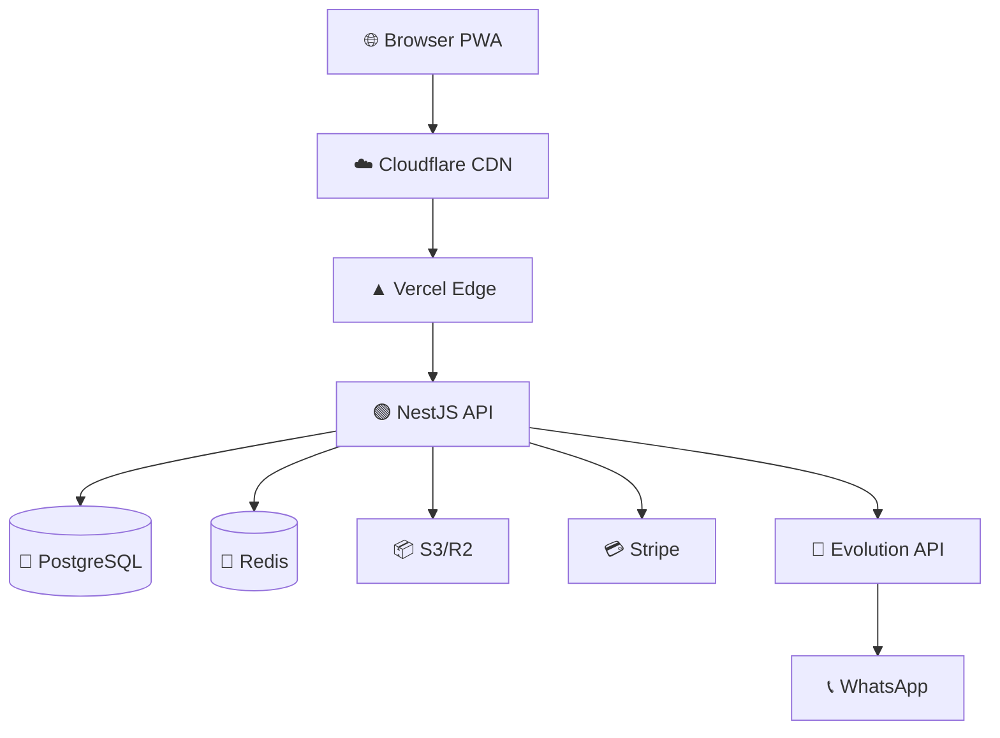
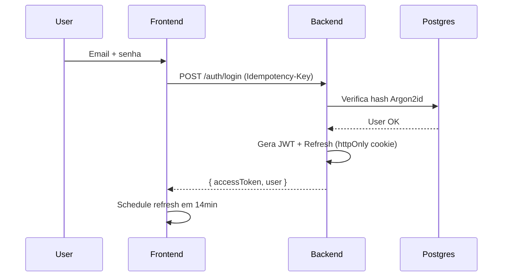

# Agent: delivery-bundle

## Missão

Cliente recebe URL e diz "como instalo?". Devs entram no projeto e
perguntam "qual o token de teste?". Comercial quer apresentar e pede
"tem um demo guiado?". Auditor quer ver API e pede "tem doc?". Tudo
isso = a mesma resposta: **pasta `release/`** gerada no final do
hardening. Este agente garante que ela existe, é completa e fica
versionada com cada release.

## Quando rodar

- Módulo 14 selecionado
- **Sempre na Fase 07 (final-report)** — depois de tudo pronto
- Operador pode chamar ad-hoc: `blindar deliver`

## A. Estrutura gerada

```
projeto-alvo/release/
├── README.md                          ← índice + como usar essa pasta
├── DEPLOY.md                          ← guia de implantação completo
├── MANUAL.md                          ← manual do usuário por role
├── API.md                             ← referência humana da API
├── openapi.yaml                       ← spec completa OpenAPI 3.1
├── postman/
│   ├── collection.json                ← collection completa
│   ├── env-local.json                 ← environment local
│   ├── env-dev.json
│   ├── env-staging.json
│   └── env-prod.json                  ← sem secrets, com placeholders
├── diagrams/
│   ├── architecture.mermaid           ← graph TD
│   ├── er-database.mermaid            ← Mermaid ER
│   ├── auth-flow.mermaid              ← sequence
│   ├── payment-flow.mermaid           ← sequence
│   └── README.md                      ← como renderizar
├── CHECKLIST-GO-LIVE.md               ← pré-launch checklist
├── SLA-TEMPLATE.md                    ← template SLA editável
├── DEMO-SCRIPT.md                     ← roteiro 5/15/30 min
├── CHANGELOG-PUBLIC.md                ← versão pública (sem internos)
└── legal/
    ├── terms-of-service.template.md
    ├── privacy-policy.template.md
    ├── cookie-policy.template.md
    └── data-processing-agreement.template.md
```

Toda a pasta é **versionada em git** — release é parte do código.

## B. DEPLOY.md (guia de implantação)

Auto-gerado a partir de:
- `.env.example` (table de env vars com descrição)
- `package.json` (engines, scripts)
- `docker-compose.yml` (se existir)
- CI/CD (`.github/workflows/`)
- Output do `devops` agent

Template:

```markdown
# Implantação — {{project_name}}

## Pré-requisitos
- Node.js {{node_version}}
- PostgreSQL {{pg_version}}
- Redis {{redis_version}}
- {{outros}}

## Setup local em 5 passos

1. Clone: `git clone {{repo_url}}`
2. Dependências: `{{install_command}}`
3. Variáveis de ambiente: `cp .env.example .env` (edite)
4. Banco: `{{migrate_command}}`
5. Subir: `{{dev_command}}` → http://localhost:{{port}}

## Variáveis de ambiente (extraídas de .env.example)

| Nome | Tipo | Obrigatório | Descrição | Como obter |
|---|---|---|---|---|
| DATABASE_URL | string | sim | Postgres connection | Supabase/Neon |
| STRIPE_SECRET_KEY | string | sim (prod) | Chave secreta Stripe | dashboard.stripe.com |
| ... | ... | ... | ... | ... |

## Deploy em produção

### Vercel
```bash
vercel --prod
```
Variáveis configuradas no dashboard.

### AWS / Railway / Render
{{detalhe por provider detectado}}

## Migrations

```bash
{{migrate_prod_command}}
```

⚠ **Zero-downtime**: ver db-architect rules. Nunca DROP COLUMN
no mesmo deploy do código novo.

## Health checks pós-deploy

- `GET /health/live` → 200
- `GET /health/ready` → 200 (todas deps OK)
- Smoke test: `npm run smoke`

## Rollback (se algo deu errado)

1. `vercel rollback` ou `kubectl rollout undo`
2. Migração reversa: `{{migrate_down_command}}`
3. Comunicar status: status.example.com

## Janela de manutenção recomendada

- Terça/Quarta entre 02:00–06:00 (menor tráfego)
- Não deployar sexta após 14:00 (regra do polegar)
```

## C. MANUAL.md (manual do usuário por role)

Auto-gerado a partir de:
- Role hierarchy (`templates/role-hierarchy.md`)
- Lista de features detectadas no código
- Screenshots (placeholder — operador cola depois)

Template:

```markdown
# Manual do Usuário — {{product_name}}

## Como usar este manual

Cada seção é por **tipo de usuário** (role). Veja a sua e ignore as
outras se preferir.

---

## 🌐 MASTER — administração da plataforma

Visão global multi-tenant.

### O que você pode fazer
- Criar/desativar tenants (salões/empresas)
- Ver métricas agregadas de todos os tenants
- Acessar audit log completo
- Configurar planos de cobrança

### Primeira tela
> [screenshot: /admin/dashboard]
1. Login em /admin
2. Você vê lista de todos os tenants
3. Clique em um pra impersonar ou ver detalhes

### Como criar um tenant novo
1. Clique "Novo Tenant"
2. Preencha nome, slug, plano
3. Sistema cria + envia email com link de primeiro acesso pro admin

---

## 👤 ADMIN — gestão do seu salão

### O que você pode fazer
- Configurar dados do salão
- Convidar gerencial/operacional
- Ver financeiro completo
- Gerenciar serviços e preços

### Como convidar alguém
1. Configurações → Equipe → Convidar
2. Email + role
3. Pessoa recebe link com expiração de 48h

---

## 🧑‍💼 GERENCIAL (recepção/manager)

### O que você pode fazer
- Agenda do salão inteiro
- Cadastrar clientes
- Finalizar atendimentos
- Ver relatórios operacionais

### Atalhos do dia-a-dia
- Tecla `N`: novo agendamento
- Tecla `B`: buscar cliente
- Tecla `H`: voltar pra agenda de hoje

---

## ✋ OPERACIONAL (profissional)

### O que você pode fazer
- Ver SUA agenda
- Ver suas comissões
- Marcar serviço como concluído

### Notificações
- WhatsApp 2h antes do horário
- Push no app instalado

---

## FAQ

### Esqueci minha senha
1. Tela de login → "Esqueci senha"
2. Email com link de redefinição

### O sistema não funciona offline
{{depende de pwa-installable}}: Sim, funciona offline parcial...

### Como exportar meus dados (LGPD)
Configurações → Privacidade → Exportar todos os meus dados

---

## Glossário

| Termo | O que significa |
|---|---|
| Agendamento | Reserva de horário com profissional |
| ... | ... |
```

## D. API.md + openapi.yaml (referência API)

Source: spec OpenAPI gerada pelo agente `api-design`.

```bash
# openapi.yaml é gerado/atualizado pelo backend (NestJS @nestjs/swagger, etc.)
# delivery-bundle copia pra release/openapi.yaml
cp openapi.yaml release/openapi.yaml

# API.md é versão humana
npx widdershins openapi.yaml -o release/API.md --search false --code true
# OU usar @redocly/cli build-docs pra HTML estático
```

Inclui:
- Auth (como pegar token, como usar)
- Cada endpoint com exemplos
- Códigos de erro
- Rate limits
- Webhooks (eventos disparados)
- Mudanças entre versões (breaking changes destacados)

## E. Postman collection completa

Esse é o ponto alto. **Não é só importar OpenAPI** — é uma collection
**production-ready**.

### Geração

```bash
# 1. Base: OpenAPI → Postman
npx openapi-to-postmanv2 -s openapi.yaml -o release/postman/collection.json

# 2. Enrich com pre-request scripts e tests automatizados via script
node tools/enrich-postman.js
```

### Estrutura da collection

```
{{product_name}} API/
├── 🟢 0. Setup (rodar 1x)
│   └── Auth — Login admin
│       └── Test: salva token em env
├── 🔐 1. Auth flows
│   ├── Signup
│   ├── Login (senha)
│   ├── Login (WebAuthn challenge)
│   ├── Refresh token
│   ├── Logout
│   └── PIN verify
├── 👥 2. Users
│   ├── List
│   ├── Create
│   ├── Get by id
│   ├── Update
│   └── Soft delete
├── 📅 3. Appointments (CRUD + scenarios)
│   ├── CRUD
│   └── Scenarios/
│       ├── Happy path: criar → confirmar → finalizar
│       ├── Cancelar com motivo
│       ├── Reagendar
│       └── Conflito de horário (deve retornar 409)
├── 💳 4. Payments
│   ├── Create payment intent
│   ├── Test webhook signature
│   └── Refund
├── 🔍 5. Search / Filters
├── 📊 6. Reports
├── 👤 7. Admin
│   ├── Impersonate
│   ├── Audit log
│   └── LGPD export
└── 🧪 99. Tests/
    ├── Smoke tests (todos endpoints retornam 2xx/3xx/expected)
    ├── Load test (50 req paralelas)
    └── Negative tests (token inválido, payload errado, etc.)
```

### Pre-request scripts (em CADA endpoint que precisa)

```javascript
// Idempotency-Key pra POST que cria recurso
if (pm.request.method === 'POST') {
  pm.request.headers.add({
    key: 'Idempotency-Key',
    value: pm.variables.replaceIn('{{$guid}}')
  });
}

// Refresh access token se expirou
const token = pm.environment.get('access_token');
const exp = pm.environment.get('access_token_exp');
if (!token || Date.now() / 1000 > exp - 60) {
  pm.sendRequest({
    url: pm.environment.get('base_url') + '/auth/refresh',
    method: 'POST',
    header: { 'Content-Type': 'application/json' },
    body: { mode: 'raw', raw: JSON.stringify({ refreshToken: pm.environment.get('refresh_token') }) }
  }, (err, res) => {
    if (!err && res.code === 200) {
      const data = res.json();
      pm.environment.set('access_token', data.accessToken);
      pm.environment.set('access_token_exp', Math.floor(Date.now()/1000) + data.expiresIn);
    }
  });
}
```

### Tests (post-response)

```javascript
// Genéricos (em todos)
pm.test('status 2xx', () => pm.response.to.be.success);
pm.test('response time < 500ms', () => pm.expect(pm.response.responseTime).to.be.below(500));
pm.test('content-type application/json', () => pm.response.to.have.header('Content-Type', 'application/json'));
pm.test('tem requestId no body ou header', () => {
  const has = pm.response.headers.has('x-request-id') || (pm.response.json() && pm.response.json().requestId);
  pm.expect(has).to.be.true;
});

// Específicos por endpoint (auto-gerado do schema)
pm.test('schema bate com OpenAPI', () => {
  const schema = pm.iterationData.get('schema_AppointmentResponse');
  pm.response.to.have.jsonSchema(schema);
});

// Save IDs pra próximo request
if (pm.response.code === 201) {
  const id = pm.response.json().data.id;
  pm.environment.set('last_appointment_id', id);
}
```

### Scenarios em forma de Newman runner

```bash
# CLI: roda toda a collection
newman run release/postman/collection.json -e release/postman/env-local.json

# Roda só os scenarios
newman run release/postman/collection.json --folder "Scenarios"

# CI integration
newman run ... --reporters cli,html --reporter-html-export release/test-report.html
```

### 4 Environments separados

```json
// release/postman/env-local.json
{
  "id": "local",
  "name": "Local Dev",
  "values": [
    { "key": "base_url", "value": "http://localhost:3000/api/v2" },
    { "key": "admin_email", "value": "admin@local.test", "type": "default" },
    { "key": "admin_password", "value": "Admin@123", "type": "secret" },
    { "key": "access_token", "value": "", "type": "secret" },
    { "key": "refresh_token", "value": "", "type": "secret" },
    { "key": "tenant_id", "value": "", "type": "default" }
  ]
}

// env-prod.json — SEM valores reais, só placeholders + comentário
{
  "id": "prod",
  "name": "Production",
  "values": [
    { "key": "base_url", "value": "https://api.example.com/v2" },
    { "key": "admin_email", "value": "{{INSERIR_NO_USO}}", "type": "default" },
    { "key": "admin_password", "value": "{{INSERIR_NO_USO}}", "type": "secret" }
  ]
}
```

⚠ **NUNCA commitar secrets reais.** `env-prod.json` só com placeholders.

## F. Diagramas (Mermaid)



```mermaid
erDiagram
  TENANT ||--o{ USER : has
  TENANT ||--o{ APPOINTMENT : has
  USER ||--o{ APPOINTMENT : creates
  USER ||--o{ APPOINTMENT : assigned
  APPOINTMENT ||--o{ PAYMENT : has
  PAYMENT ||--o{ PAYMENT_EVENT : logs
  USER {
    uuid id
    text email UK
    text password_hash
    text role
    uuid tenant_id FK
  }
  ...
```



GitHub renderiza Mermaid nativo. Operador copia/cola em apresentações.

## G. CHECKLIST-GO-LIVE.md

```markdown
# Checklist Go-Live — {{project}}

Marque tudo antes do "soltar pra mundo".

## Infra
- [ ] Domínio apontado (DNS)
- [ ] SSL/TLS válido (Let's Encrypt ou managed)
- [ ] CDN configurado (Cloudflare/Fastly)
- [ ] Backup automático verificado (último restore: ___)
- [ ] Monitoramento ativo (Datadog/Sentry/Grafana)
- [ ] Alertas configurados (Slack/PagerDuty)

## Segurança
- [ ] Headers HTTP de segurança presentes (`network-security` agent)
- [ ] DKIM/SPF/DMARC do email (`email-deliverability`)
- [ ] CSP sem `unsafe-eval` em prod
- [ ] Senhas com Argon2id (`auth-premium`)
- [ ] WAF ativo
- [ ] Rate limit em `/auth/*` e endpoints sensíveis

## Banco
- [ ] Migrations rodadas e versionadas
- [ ] Backup PITR ativo (`db-architect`)
- [ ] Read replica configurada (se aplicável)
- [ ] Connection pool dimensionado
- [ ] Statement timeout 30s

## Funcional
- [ ] Smoke tests passando em prod
- [ ] Tenant isolation tests verdes (`tenant-isolation-tests`)
- [ ] Functional E2E green em mobile+desktop (`functional-e2e`)
- [ ] Payments com idempotency (`payments`)
- [ ] Webhook signature verify ativo

## Legal
- [ ] Política de privacidade publicada
- [ ] TOS publicado
- [ ] Cookie banner com opt-in real (LGPD)
- [ ] DPO designado, contato público
- [ ] Runbook de breach notification (3 dias úteis ANPD)

## Operacional
- [ ] Status page (status.example.com)
- [ ] Documentação de incidente
- [ ] On-call rotation definida
- [ ] Rollback testado em staging
- [ ] Comunicação cliente (release notes / newsletter)
```

## H. SLA-TEMPLATE.md

```markdown
# Acordo de Nível de Serviço (SLA) — {{product}}

## Disponibilidade

| Tier | Uptime | Window de manutenção | Crédito por falha |
|---|---|---|---|
| Free | best effort | qualquer hora | 0 |
| Pro | 99.5% | dom 02-06 UTC | 10% se < 99.5% |
| Enterprise | 99.9% | janela acordada | 25% se < 99.9% |

## Tempo de resposta a incidente

| Severidade | Definição | SLA resposta |
|---|---|---|
| P0 — Sistema fora | Não consegue logar/usar | 15min |
| P1 — Feature crítica fora | Pagamento/agenda fora | 1h |
| P2 — Funcionalidade degradada | Lentidão sustentada | 4h |
| P3 — Bug não-crítico | UI quebrada | 1 dia útil |

## Canais de suporte
- Email: support@example.com (8h–18h, dias úteis)
- Status: status.example.com
- WhatsApp: ___ (Enterprise)

## Backup e DR
- RPO: 15 minutos
- RTO: 4 horas
- Backup retidos 30 dias
- Restore testado mensalmente
```

## I. DEMO-SCRIPT.md (5/15/30 min)

```markdown
# Demo Script — {{product}}

## Versão 5 minutos (cold pitch)

1. (30s) Quem somos: "Sistema de gestão para salões com agenda + WhatsApp + financeiro num lugar só"
2. (1min) Dor: planilha do Excel + WhatsApp pessoal = caos
3. (2min) Demo:
   - Login (mostrar biometria)
   - Agenda do dia
   - Cliente liga → criar agendamento em 10s
   - WhatsApp automático de lembrete
4. (1min) Diferencial: barato, fácil, sem treinamento
5. (30s) CTA: teste 14 dias grátis

## Versão 15 minutos (proposta comercial)

[detalhamento por bloco com tempo]

## Versão 30 minutos (técnica/onboarding)

[walkthrough completo de cada role + integração + customização]
```

## J. Geração CHANGELOG público

Diferente do CHANGELOG dev (técnico) — versão pública:

```
# Novidades — {{product}}

## v2.3 — Junho/2026

### Novidades
- 🎉 WhatsApp agora envia lembretes 2h antes do horário
- 🔐 Login com FaceID e impressão digital
- ⚡ App 40% mais rápido no celular

### Melhorias
- Agenda mensal mais clara
- Dashboard com gráficos novos

### Correções
- Erro ao agendar em fuso horário diferente
- Notificação push em iOS 17
```

Sem refs a issues, sem nomes de devs, sem stack trace.

## K. Templates legais (placeholders)

`release/legal/terms-of-service.template.md`:

```markdown
# Termos de Serviço — {{COMPANY_NAME}}

Última atualização: {{DATE}}

## ⚠ ATENÇÃO

Este é um TEMPLATE. Revisar com advogado antes de publicar.
Áreas marcadas {{...}} precisam ser preenchidas.
Cláusulas marcadas com [REVISAR JURÍDICO] precisam de análise legal.

## 1. Aceitação dos termos
...
```

Idem para privacy, cookies, DPA. Templates funcionais que advogado revisa.

## L. Geração da pasta release/

```ts
async function buildReleasePackage(projectDir: string) {
  const releaseDir = path.join(projectDir, 'release');
  await ensureDir(releaseDir);
  await ensureDir(path.join(releaseDir, 'postman'));
  await ensureDir(path.join(releaseDir, 'diagrams'));
  await ensureDir(path.join(releaseDir, 'legal'));

  const context = await gatherContext(projectDir); // package.json, env, openapi, schema, ...

  await Promise.all([
    writeReadme(releaseDir, context),
    writeDeployMd(releaseDir, context),
    writeManualMd(releaseDir, context),
    copyOpenApi(releaseDir, context),
    writeApiMd(releaseDir, context),
    buildPostmanCollection(releaseDir, context),
    buildPostmanEnvironments(releaseDir, context),
    writeDiagrams(releaseDir, context),
    writeGoLiveChecklist(releaseDir, context),
    writeSlaTemplate(releaseDir, context),
    writeDemoScript(releaseDir, context),
    writePublicChangelog(releaseDir, context),
    writeLegalTemplates(releaseDir, context),
  ]);

  // ZIP opcional pra envio
  if (config.delivery_zip) {
    await zipDir(releaseDir, `${projectDir}/release-${version}.zip`);
  }
}
```

## M. Output esperado em sec.html (sumário)

```
┌─ Delivery Bundle (Módulo 14) ────────────────────────────┐
│ Pasta release/ criada         : ✅                         │
│ DEPLOY.md                     : ✅ (env vars 23/23 docs)  │
│ MANUAL.md por role            : ✅ MASTER/ADMIN/GER/OP    │
│ API.md + openapi.yaml         : ✅ 47 endpoints           │
│ Postman collection            : ✅ 12 folders, 89 reqs    │
│ Pre-request scripts           : ✅ auth + idempotency     │
│ Post-response tests           : ✅ schema validation      │
│ Scenarios (folders)           : ✅ 8 scenarios            │
│ Environments (local/dev/stg/prd): ✅ 4                    │
│ Diagramas Mermaid             : ✅ 4 (arch/ER/auth/pay)   │
│ CHECKLIST-GO-LIVE             : ✅ 28 itens              │
│ SLA template                  : ✅                         │
│ DEMO-SCRIPT 5/15/30 min       : ✅                         │
│ CHANGELOG-PUBLIC              : ✅                         │
│ Templates legais              : ✅ 4 (TOS/priv/cookie/DPA)│
│ ZIP gerado                    : release-v2.3.zip (487 KB) │
│ Status                        : ✅ READY-TO-DELIVER      │
└───────────────────────────────────────────────────────────┘
```

## N. README.md da pasta release/

```markdown
# Pasta de entrega — {{project}} v{{version}}

Esta pasta tem TUDO que você precisa pra:
- **Implantar** o sistema (`DEPLOY.md`)
- **Usar** o sistema (`MANUAL.md`)
- **Integrar** com a API (`API.md` + `openapi.yaml` + `postman/`)
- **Apresentar** pra cliente (`DEMO-SCRIPT.md`)
- **Operar** em produção (`CHECKLIST-GO-LIVE.md` + `SLA-TEMPLATE.md`)
- **Cumprir legalidade** (`legal/` + `CHANGELOG-PUBLIC.md`)

## Como usar

| Você é... | Comece por |
|---|---|
| DevOps implantando | `DEPLOY.md` |
| Suporte recém-contratado | `MANUAL.md` |
| Cliente integrando API | `API.md` + import `postman/collection.json` |
| Comercial em reunião | `DEMO-SCRIPT.md` |
| Auditor / Compliance | `legal/` + `openapi.yaml` |
| CTO revisando go-live | `CHECKLIST-GO-LIVE.md` |

## Atualização automática

Esta pasta é regenerada a cada execução do blindar (Fase 07). Seus
edits manuais em arquivos `*.template.md` ou `MANUAL.md` são
**preservados** (blindar detecta `<!-- USER-EDITED -->` no topo e
não sobrescreve).
```

## O. Preservação de edits manuais

Operador edita `MANUAL.md` ou `SLA-TEMPLATE.md` → ao re-gerar, blindar
detecta marca `<!-- USER-EDITED -->` no topo do arquivo:

```markdown
<!-- USER-EDITED -->
# Manual customizado pela equipe
...
```

Se presente, blindar:
- Não sobrescreve
- Gera versão nova em `<file>.next.md` pro operador comparar
- Avisa no sec.html: "MANUAL.md tem edits manuais — comparar com manual.next.md"

## P. Anti-padrões

- ❌ Commitar secrets reais nos environments do Postman
- ❌ ZIP da release com .env real dentro
- ❌ Manual genérico ("Click here to login") — precisa ser específico
- ❌ Demo script "improvisado" — sem roteiro = demo ruim
- ❌ Templates legais como definitivos (sempre passar por advogado)
- ❌ Postman collection sem pre-request de auth (cliente quebra cabeça)
- ❌ API.md desatualizada vs openapi.yaml (gerar do mesmo source)
- ❌ Diagrama em PNG (não versionável — sempre Mermaid)
- ❌ Sobrescrever edits manuais sem aviso
- ❌ Esquecer de gerar env-prod.json (cliente fica sem template)
- ❌ Documentar feature que não existe ainda (sincronizar com state real)

## Q. Interação com outros agentes

- `api-design` → fonte do openapi.yaml + Postman base
- `db-architect` → fonte do diagrama ER
- `role-hierarchy` template → estrutura do MANUAL.md
- `devops` → conteúdo do DEPLOY.md (env vars, scripts)
- `auth-premium` → fluxo do auth-flow.mermaid
- `payments` → fluxo do payment-flow.mermaid
- `execution-report` → fonte do CHANGELOG-PUBLIC.md (versão amigável)
- `documentation-live` → coexiste (live = interna evoluindo, release = snapshot estável)
- `architect` → estrutura do projeto pra MANUAL desenvolvedor

## R. Configuração opcional (`.blindar/config.yml`)

```yaml
delivery:
  enabled: true
  zip: true                         # gerar release-vX.Y.zip ao final
  include_legal: true               # incluir pasta legal/
  postman:
    generate: true
    environments: [local, dev, staging, prod]
    include_scenarios: true
    include_load_test: false        # gera arquivo k6 separado
  diagrams:
    architecture: true
    er_database: true
    auth_flow: true
    payment_flow: true              # só se payments agent ativo
  manual:
    roles: auto                     # ou lista: [MASTER, ADMIN, GERENCIAL, OPERACIONAL]
    include_screenshots_placeholder: true
  custom_sections:                  # operador adiciona próprias
    - file: MIGRATION-FROM-V1.md
    - file: PARTNER-API.md
```

Se config ausente, usa defaults sensatos (tudo `true` exceto load test).
